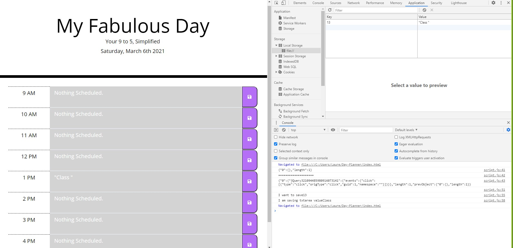

# 05 Third-Party APIs: Work Day Scheduler

Welcome to My Fabulous Day!
Your 9 to 5, Simplified.

This simple work day calendar application allows the fabulous user (that's you!) to save appointments and events for every hour of the day. 
This App runs in browser on dynamically updaed HTML and CSS powered by jQuery.
Using the Moment.js library enables easy use of current date and time. 
Using pastels, we make it easy on the eyes!

Here is the deployed website URL:

[Github URL](https://lawriedrew.github.io/Day-Planner/)

Copyright (c) [2021] [Columbia School of Engineering]

Permission is hereby granted, free of charge, to any person obtaining a copy
of this software and associated documentation files (the "Software"), to deal
in the Software without restriction, including without limitation the rights
to use, copy, modify, merge, publish, distribute, sublicense, and/or sell
copies of the Software, and to permit persons to whom the Software is
furnished to do so, subject to the following conditions:

The above copyright notice and this permission notice shall be included in all
copies or substantial portions of the Software.

THE SOFTWARE IS PROVIDED "AS IS", WITHOUT WARRANTY OF ANY KIND, EXPRESS OR
IMPLIED, INCLUDING BUT NOT LIMITED TO THE WARRANTIES OF MERCHANTABILITY,
FITNESS FOR A PARTICULAR PURPOSE AND NONINFRINGEMENT. IN NO EVENT SHALL THE
AUTHORS OR COPYRIGHT HOLDERS BE LIABLE FOR ANY CLAIM, DAMAGES OR OTHER
LIABILITY, WHETHER IN AN ACTION OF CONTRACT, TORT OR OTHERWISE, ARISING FROM,
OUT OF OR IN CONNECTION WITH THE SOFTWARE OR THE USE OR OTHER DEALINGS IN THE
SOFTWARE.

